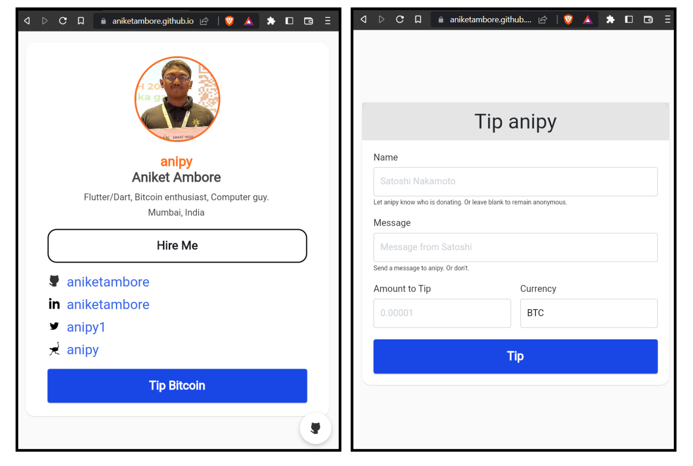

    
    <h1> Personal Bitcoin Tip Card </h1>

<h3 align="center"> A Personal Bitcoin Tip Card created using Flutter Web and BTCPay API! 🚀 </h3>

## Screens Specification

Here's how it works: when someone clicks the Tip Bitcoin button, they'll be taken to a tipping form where they can enter the amount, their name, and a message. The form then generates an invoice using the BTCPay API, which the user can pay using their Bitcoin wallet.

One of the best things about this project is that it follows the best practices for generating invoices securely. For example, the XPUB is stored only on the BTCPay API server in watch-only mode, which means that an infinite number of Bitcoin addresses can be generated for receiving tips while keeping everything secure.

If you're interested in setting up your own Personal Bitcoin Tip Card, check out this blog article for more information. Let me know if you have any questions or feedback!

## Contributing:

 - Fork it!
 - Create your feature branch: `git checkout -b my-new-feature`
 - Commit your changes: `git commit -am 'Add some feature'`
 - Push to the branch: `git push origin my-new-feature`
 - Submit a pull request.

 <h3 align="center">Show some ❤ and star the repo to support the project</h3>